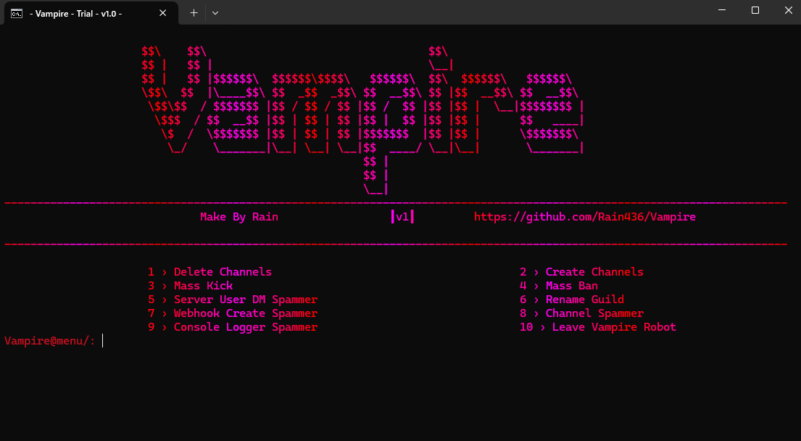

# Vampire
Veriosn: 1.0

- New Discord Multi tool with various features -
- Make in Python 3 -
- Work Process...

# features
- Delete Channels
- Mass Kick
- Server User DM Spammer
- Webhook Create Spammer
- Console Logger Spammer
- Create Channels
- Mass Ban
- Rename Guild
- Channel Spammer
- Leave Vampire Robot

  # How To Use
  - Step 1 -
    
  - Open account_data
  - Token.json Open
  - Paste Owned Bot Token
    
  -  Step 2 -
  -  Python 3.11.8 install
  -  Open install.bat
  -  wait..
  -  open The Loader.bat
    
# ⚠️ Warings ⚠️
## I created these for educational purposes, and we will not be held responsible for any damage caused to you by using them.
## skid basically does not allow

# Credit
Rain436 - Ui, Fatures, Bugfix, Support, Design, Name
